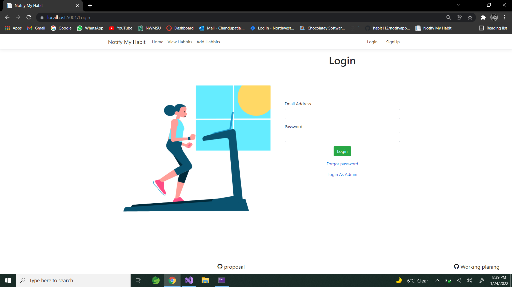
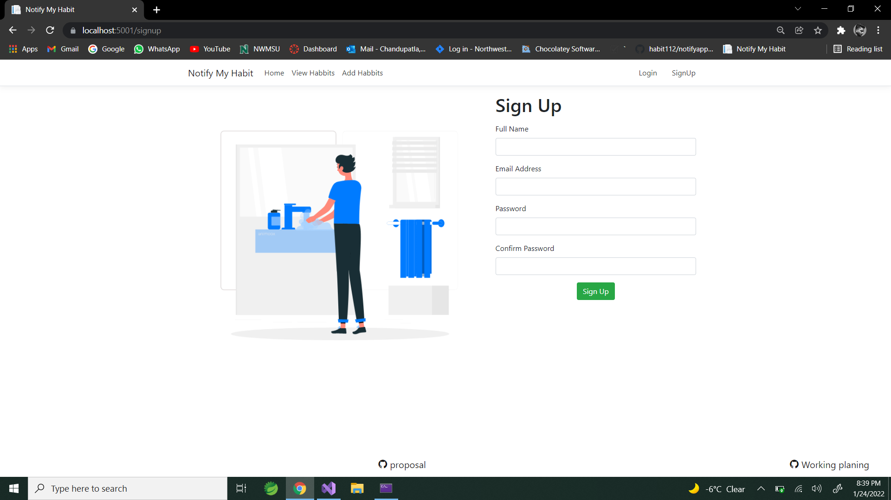

# Proposal For the [Habit Reminder](https://github.com/NaveenTanuku/HabitReminder)
## Introduction
The goal of our web application is to display a student's habit based on the weekday. When the user clicks on a habit, it displays several photos and text descriptions, as well as a checkbox to see if the habit was completed today or not. We can reward the account with points or credits if the user completes the habit for the day.

## Schedule & sprints 
• GDP semesters determine the schedule and sprints (approximately every two weeks Equals a sprint). 

### Sprint 1  
#### Gather Requirements 
We need to figure out exactly what you require and what you believe in. Only then can we start designing a design that reflects the value you provide in a way that resonates with the people who matter: your app's users.

### Sprint 2 
####  Design Presentation
• Using Front-end page plan (single-page web app (SPA) and Front-end responsive design, a new design concept will be presented based on your sketches (Bootstrap). There will undoubtedly be a common subject, but we will strive to think outside the box and come up with something unique. The best ideas are frequently generated in this manner.

### Sprint 3 
#### Website Build
• Your website is built with the basic home page utilizing Backend language + framework (Java / Spring (or Spring Boot) and the database for the Application is generated using everything we've learned. The data can now be dynamically accessed from the database. We'll give it to you after it's finished and go over the details in accordance with the goals we set out to achieve.

### Sprint 4
####  Testing and Installation
The functionalities that have been built so far have been tested, and the application is currently hosted on Heroku and will operate on any device. Any deployment difficulties will be addressed, and the application will be ready for further development next semester.

### Sprint 5
#### Authentication and Authorization. 
Users will be able to Login by Authenticating using their username and password when the SignUp and Login Pages have been developed and linked with the backend. New users can also sign up for an account, and their information will be uploaded to the cloud database.

### Sprint 6
#### Geolocations to be added
The user will be able to add new Geolocations after logging in, and they will be saved in the database. All other users will be able to see the newly added Locations. The ability to remove the Location will be introduced as well. The user will be able to execute all CRUD operations at this stage.

### Sprint 7
#### Adding features
By the end of the sprint, we'll have included audio and video features to every habit in the app, as well as a canvas for the need, necessary attribute, and regular expression. 

### Sprint 8
#### Finalizing and Testing 
There will be a Like button added, and the Locations will be prioritized based on the number of likes. The ability to refresh a random place on the Home Page every day. The entire software will be put through its paces.

### Sprint 9
#### Demonstration
The Client will be shown the whole version of the Application, and any changes or suggestions made by the Client will be applied. The application's final version will be released.

## Budget 

| S. No. | Name                                                  |Hourly Pay|   Role            | Hours/ Daily |  Estimated Cost/ Weekly | Email  |
|------|---------------------------------------------------------|----------------------------------|-------------------------------| ------------- | -------| --|
| 1  | [Rohit Reddy Chandupatla](https://github.com/Rohitreddz)  |  $40 |    Front-end Developer   |   8 - 9 |  $1600 - $1800 |  s542423@nwmissouri.edu  |9
| 2    | [Akanksha Sudhagoni](https://github.com/S542046)        | $40  | Back-end Developer   | 8 - 9 |   $1600 - $1800 | s542046@nwmissouri.edu  |
## Technological stack
####  Backend language + framework 
‣ Java Spring Boot 
#### Backend app host 
‣ Heroku
#### Data host + type 
‣ Postgresql
#### Front-end page plan 
‣ Angular (SPA) 
#### Front-end responsive design 
‣ Bootstrap
#### Static analysis tools 
‣ Codacy

### Screenshots of Applications
    
    
   
  
 ### ***To Accept, Sign Below***

